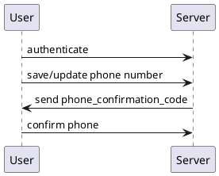
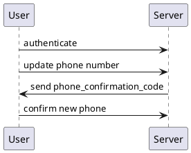
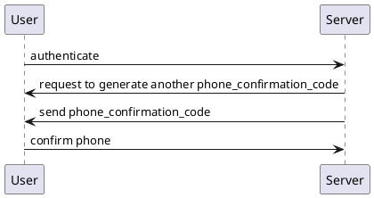

- регистрация и подтверждение емайла:
```plantuml
User -> Server: register
Server -> User: send email_confirmation_code
User -> Server: confirm email
```

- ввод номера телефона и подтверждение:


- изменение существующего номера телефона и подтверждение:



- юзер не получил смс с подтверждением, запрос нового кода:

